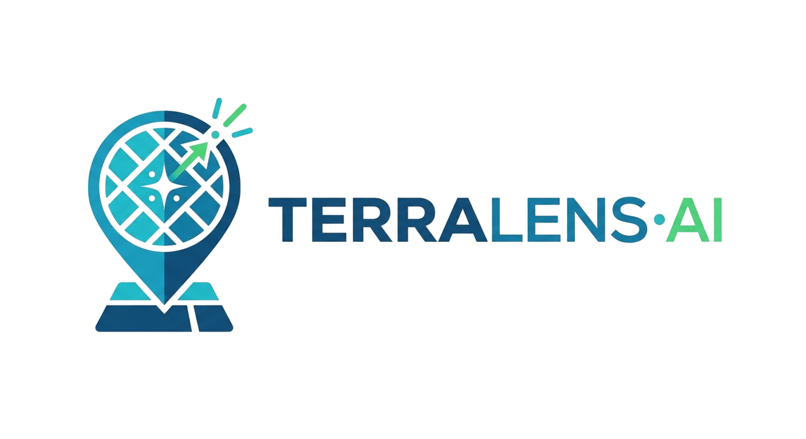

# 🌍 TerraLens AI — Real Estate Intelligence Platform

<div align="center">



**Map-first real estate intelligence platform for Tunisia**
*AI-powered market analysis · Demand forecasting · Risk assessment*

[](https://nextjs.org/)
[](https://maplibre.org/)
[](https://groq.com/)
[](LICENSE)

</div>

---

## 📋 Table of Contents
- [Overview](#overview)
- [Architecture](#architecture)
- [Features](#features)
- [Tech Stack](#tech-stack)
- [Getting Started](#getting-started)
- [Data Pipeline](#data-pipeline)
- [Intelligence Modes](#intelligence-modes)
- [Project Structure](#project-structure)
- [API Reference](#api-reference)
- [Team](#team)

---

## Overview

**TerraLens AI** is a GeoAI-powered platform that provides real estate developers, investors, and marketing teams with actionable spatial intelligence across Tunisia's 24 governorates, 264 delegations, and 2,084 sectors.

The platform combines **MapLibre GL JS** geospatial visualization with **Groq LLaMA 3.3 70B** AI recommendations to deliver three core intelligence modules:

| Module | Purpose | Key Insight |
|--------|---------|-------------|
| 🔵 **Marketing Intelligence** | Optimize ad spend & lead targeting | Where are your highest-value buyers coming from? |
| 🟣 **Prediction & Planning** | Forecast demand & absorption | Which zones will see the highest price growth? |
| 🔴 **Risk & Mitigation** | Identify risks & competitor pressure | Where is Tecnocasa expanding near your projects? |

---

## Architecture

```
┌─────────────────────────────────────────────────────────────────┐
│                        TerraLens AI                             │
├─────────────────────────────────────────────────────────────────┤
│                                                                 │
│  ┌──────────┐  ┌──────────────────┐  ┌───────────────────────┐ │
│  │  TopBar   │  │  MapLibre GL JS  │  │   Right Panel         │ │
│  │ Category  │  │  ┌────────────┐  │  │  Groq ML AI Agent     │ │
│  │  Switcher │  │  │  MapTiler  │  │  │  (Structured JSON)    │ │
│  └──────────┘  │  │  Dark Tiles │  │  │  Zone Details         │ │
│                │  └────────────┘  │  └───────────────────────┘ │
│  ┌──────────┐  │  ┌────────────┐  │                            │
│  │  Left    │  │  │ GeoJSON    │  │  ┌───────────────────────┐ │
│  │  Panel   │  │  │ Layers     │  │  │  /api/recommend       │ │
│  │  KPIs &  │  │  │ (7 layers) │  │  │  LLaMA 3.3 (CoT)      │ │
│  │  ML Stats│  │  └────────────┘  │  └───────────────────────┘ │
│  └──────────┘  └──────────────────┘                            │
│                                                                 │
├─────────────────────────────────────────────────────────────────┤
│                    Machine Learning Pipeline                    │
│  XGBoost Regressors (Price/Demand) · Isolation Forest (Risk)    │
│  Point-in-Polygon (Ray-casting) · INS 2024 Base Data            │
└─────────────────────────────────────────────────────────────────┘
```

---

## Features

### 🗺️ Interactive Map
- Full-screen dark-themed MapTiler basemap centered on Tunisia
- **7 data layers**: governorate choropleth, delegation boundaries, project markers, lead heatmap, buyer scatter, competitor (Tecnocasa) markers, risk zone polygons
- Hover tooltips with zone stats, click-to-inspect with fly-to animations
- Dynamic color ramps that change per active intelligence mode

### 📊 Analytics Dashboard
- **KPI cards** with trend indicators
- **Recharts visualizations**: bar charts, area charts, donut charts
- **ML Engine Status**: Live tracking of XGBoost R² accuracy scores and Isolation Forest risk anomaly counts
- Adapts content per active mode (Marketing / Forecast / Risk)

### 🤖 AI Recommendations
- Powered by **Groq LLaMA 3.3 70B** and Enriched by XGBoost
- Chain-of-Thought (CoT) pipeline producing structured JSON strategies: `Verdict`, `Primary Strategy`, `Risk Warning`, and `Pricing Action`
- Actionable strategies based on deep ML feature correlations

### 🏢 Competitive Intelligence
- **30 real Tecnocasa Tunisia agency locations** mapped
- Market share analysis per zone
- Competitor pressure overlay
- Always-visible markers across all modes

---

## Tech Stack

| Layer | Technology |
|-------|-----------|
| **Frontend** | Next.js 16 (App Router), React 19 |
| **Styling** | Tailwind CSS 4, CSS Custom Properties |
| **Map Engine** | MapLibre GL JS 4.x |
| **Map Tiles** | MapTiler Streets Dark |
| **Charts** | Recharts |
| **Icons** | Lucide React |
| **AI Engine** | Groq Cloud (LLaMA 3.3 70B Versatile) w/ JSON mode |
| **ML Engine** | XGBoost, Scikit-Learn (Isolation Forest), Pandas |
| **Data Pipeline** | Python 3, Ray-casting PiP algorithm |
| **Data Sources** | INS Tunisia 2024, Mubawab, Tecnocasa |

---

## Getting Started

### Prerequisites
- **Node.js** ≥ 18
- **Python** ≥ 3.8
- **npm** ≥ 9

### 1. Clone & Install

```bash
git clone https://github.com/your-org/hack-merit.git
cd hack-merit
```

### 2. Generate Data & Train ML Models

```bash
pip install -r requirements.txt (or install scikit-learn xgboost pandas numpy)
python scripts/train_ml_models.py
```

This script:
- Generates synthetic 3-year historical base data from INS metrics
- Trains XGBoost regressors for price and demand forecasting
- Runs an Isolation Forest to flag High-Risk anomaly zones
- Outputs all JSON datasets including `ml_metrics.json`

### 3. Run Frontend

```bash
cd frontend
npm install
npm run dev
```

Open **http://localhost:3000** in your browser.

---

## Data Pipeline

### Input Data

| File | Source | Description |
|------|--------|-------------|
| `data/projects.csv` | Sample portfolio | 42 real estate projects across 7 cities |
| `TN-gouvernorats.geojson` | OpenStreetMap | 24 governorate boundaries |
| `TN-delegations.geojson` | OpenStreetMap | 264 delegation boundaries |
| `geoBoundaries-TUN-ADM3.geojson` | geoBoundaries | 2,084 sector boundaries |

### Generated Data

| File | Records | Description |
|------|---------|-------------|
| `ml_metrics.json` | 1 | XGBoost R² scores & anomaly counts |
| `projects_extended.json` | 42 | Extended projects with demand/risk scores |
| `competitors.json` | 30 | Real Tecnocasa agency locations + metrics |
| `buyer_origins.json` | 500 | Buyer origin points (land-constrained) |
| `leads.json` | 2,000 | Lead location records with weights |
| `zone_metrics.json` | 24 | Governorate-level economic indicators |
| `forecast.json` | 360 | ML-driven monthly price/demand forecasts |
| `campaigns.json` | 56 | Campaign attribution by zone/channel |
| `risk_zones.geojson` | 9 | Infrastructure & natural risk polygons |
| `governorates.geojson` | 24 | Enriched with real economic metrics |
| `delegations.geojson` | 264 | Enriched with zone-level analytics |

### Point-in-Polygon Algorithm

All scatter points (buyers, leads) use a **ray-casting algorithm** against the 24 governorate boundary polygons to ensure every generated point falls within Tunisian territory — no points in the Mediterranean.

---

## Intelligence Modes

### 🔵 Marketing Intelligence
| Sublayer | Map Visualization | Insight |
|----------|------------------|---------|
| Zone Pricing | Choropleth by `avg_price_sqm` | Price heat from 800 to 5,000 DT/m² |
| Price Rise % | Diverging choropleth by `mom_price_change_pct` | Month-over-month price momentum |
| Lead Density | Heatmap layer from 2,000 weighted lead points | Where are leads clustering? |
| Buyer Origin | Scatter plot of 500 buyer origin locations | Where do buyers come from? |
| Attribution | Choropleth by `lead_count` | Campaign performance by zone |

### 🟣 Prediction & Planning
| Sublayer | Map Visualization | Insight |
|----------|------------------|---------|
| Demand Forecast | Gov + delegation choropleth by `demand_score` | Blue → Purple → Gold intensity |
| Sales Velocity | Choropleth by `velocity_index` + project recoloring | Red (slow) → Green (fast) |
| Absorption Rate | Choropleth by `absorption_weeks` | Green (< 12w) → Red (> 48w) |

### 🔴 Risk & Mitigation
| Sublayer | Map Visualization | Insight |
|----------|------------------|---------|
| Risk Grid | Composite risk choropleth + hazard polygons | Green (safe) → Red (critical) |
| Competitor Pressure | Prominent Tecnocasa markers + labels | 30 real agency locations |
| Oversupply | Absorption-based choropleth at delegation level | Where is inventory stuck? |
| Infrastructure Risk | Risk zone polygons only (floods, seismic, erosion) | 9 real hazard zones |

---

## Project Structure

```
hack-merit/
├── frontend/                    # Next.js 16 application
│   ├── src/
│   │   ├── app/
│   │   │   ├── layout.js        # Root layout (Inter + JetBrains Mono)
│   │   │   ├── globals.css      # Design tokens, animations
│   │   │   ├── page.js          # Dashboard orchestrator
│   │   │   └── api/recommend/
│   │   │       └── route.js     # Groq AI recommendation API
│   │   └── components/
│   │       ├── MapView.js       # MapLibre GL full-screen map (7 layers)
│   │       ├── TopBar.js        # Glassmorphic navigation
│   │       ├── LeftPanel.js     # KPIs + ML Stats + Project list
│   │       ├── RightPanel.js    # Structured JSON JSON + detail panel
│   │       └── MapLegend.js     # Dynamic map legend
│   └── public/
│       ├── data/                # ML Generated datasets
│       │   ├── geodata/         # GeoJSON boundaries
│       │   └── *.json           # Analytics & ML metrics
│       ├── terralens_logo.png
│       └── tecnocasa-tn.svg
│
├── scripts/
│   └── generate_data.py         # Data pipeline (v2 with PiP)
│
├── data/
│   └── projects.csv             # Source project portfolio
│
├── design_terralens.md          # Design system reference
├── TerraLens_AI_PRD_v1.0.md    # Product requirements
├── TN-gouvernorats.geojson      # Source governorate boundaries
├── TN-delegations.geojson       # Source delegation boundaries
└── geoBoundaries-TUN-ADM3.geojson  # ADM3 sector boundaries
```

---

## API Reference

### `POST /api/recommend`

Generates a targeted, structured AI strategy powered by LLaMA 3.3 and contextually weighted by XGBoost models.

**Request:**
```json
{
  "context": "{\"name\": \"Lac 2\", \"avg_price\": 4200, \"demand_score\": 88, \"risk_score\": 22, \"category\": \"marketing\"}"
}
```

**Response (JSON Object):**
```json
{
  "recommendation": {
    "Verdict": "Lac 2 offers a highly lucrative market with strong ML-predicted demand retention and low risk.",
    "Primary Strategy": "Increase digital advertising budget focused on high net-worth individuals targeting the available premium inventory.",
    "Risk Warning": "Ensure close monitoring of minor competitor overlaps from local agencies.",
    "Pricing Action": "Increase baseline unit pricing by +2.5% over the next quarter."
  }
}
```

---

## Team

Built during the **DEVIANT Hackathon** — 6-hour sprint.

| Role | Focus |
|------|-------|
| GeoAI Engineer | Spatial data pipeline, PiP algorithm, MapLibre integration |
| Frontend Developer | Next.js dashboard, Recharts, responsive UI |
| AI/ML Engineer | Groq API integration, recommendation engine |

---

<div align="center">

**TerraLens AI** — *See the market before the market sees you.*

</div>
